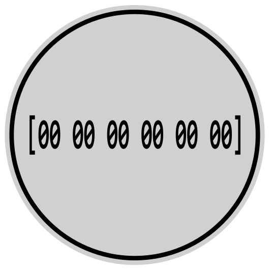

# mikenakis:buffer

#### Immutable arrays of bytes.

 
The mikenakis:buffer logo 
by Mike Nakis 
based on original work by <a href="https://thenounproject.com/">TODO</a> and <a href="https://thenounproject.com/">TODO</a> from <a href="https://thenounproject.com/">the Noun Project</a> 
used under <a href="https://creativecommons.org/licenses/by/3.0/us/">CC BY</a> license. 

## Description
                                                                                                                  
A java library which provides class `Buffer` and a few surrogates.

A `Buffer` encapsulates an immutable array of bytes.

A `Buffer` can be thought of as the equivalent of `java.lang.String`, but for bytes instead of characters. 

A `Buffer` can also be thought of as an "ANSI String". (A string of ANSI characters instead of Unicode characters.)

Surrogates provided:
 - `BufferBuilder`, which is the equivalent of `java.lang.StringBuilder`
 - `BufferBuilderOutputStream` which roughly corresponds to `java.io.ByteArrayOutputStream`.
 - etc.

## License

This creative work is explicitly published under ***No License***. 
This means that I remain the exclusive copyright holder of this creative work, 
and you may not do anything with it other than view its source code and admire it. 
More information here: [michael.gr - Open Source but No License.](https://blog.michael.gr/2018/04/open-source-but-no-license.html)

If you would like to do anything with this creative work, contact me.

## Coding style

When I write code as part of a team of developers, I use the teams' coding style. However, when I write code for myself, I use _**my very own™**_ coding style.

More information: [michael.gr - On Coding Style](https://blog.michael.gr/2018/04/on-coding-style.html)
