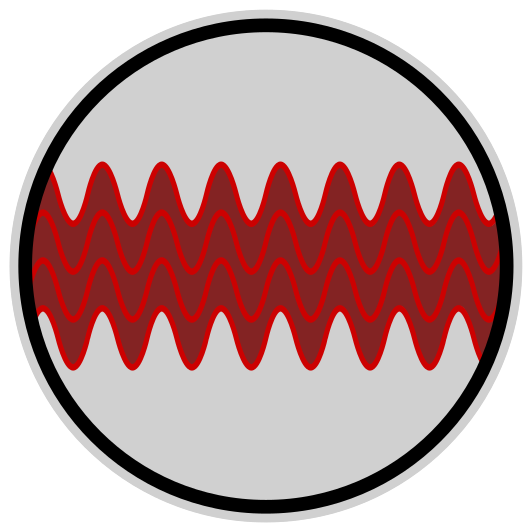

# mikenakis:coherence

#### Coherence.

 
The mikenakis:coherence Logo 
By Mike Nakis

## Description

TODO

## License

See [LICENSE.md](LICENSE.md)

## Coding style

When I write code as part of a team of developers, I use the teams' coding style.  
But when I write code for myself, I use _**my very own™**_ coding style.

More information: [michael.gr - On Coding Style](https://blog.michael.gr/2018/04/on-coding-style.html)
