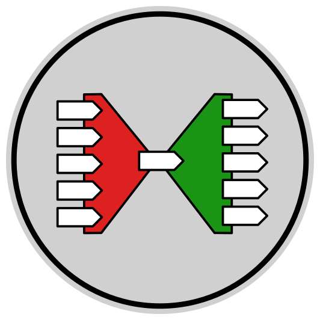

# Intertwine Normalizing Interface Invocations

A framework for automatically converting method invocations of any programmatic interface into a single-method _**normal form**_ and converting back to invocations of the original interface.

## Description

For a full explanation of what Intertwine is, what problem it solves, and how it solves it, please read this post on my blog: [michael.gr - Intertwine](https://blog.michael.gr/2022/12/intertwine.html)

The following text assumes that you have already read the blog post and that you fully understand it.

In Java, the normal form of interface method invocations is the following single-method (functional) interface:

    interface Anycall
    {
        Object anycall( MethodKey key, Object[] arguments );
    }

Entwiners generated by *mikenakis:intertwine* are a lot like the objects created by the built-in Dynamic Proxy facility of Java, (see method `newProxyInstance()` in class `Proxy` of package `java.lang.reflect`) with one very important difference: **they do not mess with exceptions.**

  - <small>The dynamic proxy that is built into the Java Runtime Environment has the extremely annoying habit of catching and rethrowing exceptions, which is a practice devoid of any usefulness whatsoever, but it does severely hamper debugging. 
  - That's because debugging relies on having the debugger always stop on any unhandled exception, but a catch-and-rethrow construct in the call tree causes exceptions thrown underneath it to appear as caught exceptions to the debugger, so the debugger does not stop at the location where they are thrown; instead, it stops at the location where they are rethrown, which is useless. 
  - The entwiners created by *mikenakis:intertwine* can serve as debugger-friendly replacements for the ill-behaving objects generated by Java's built-in dynamic proxy facility.</small>

Untwiners generated by *mikenakis:intertwine* are unlike anything that Java ships with. (For some reason, even though Java contains a dynamic proxy facility, it does not contain its other half; *mikenakis:intertwine* fixes this omission.)  An untwiner can be implemented using reflection, but it would be slow, and it can also be implemented using method handles, which are indeed considerably faster than reflection, but still not as fast as possible. The entwiners and untwiners generated by mikenakis:intertwine are as fast as their handwritten counterparts.

## Coding style

When I write code as part of a team of developers, I use the teams' coding style.  
However, when I write code for myself, I use _**my very own™**_ coding style.

More information: [michael.gr - On Coding Style](https://blog.michael.gr/2018/04/on-coding-style.html)

■
