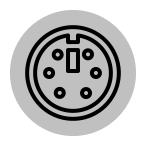

# mikenakis-io

An I/O library.

 
The mikenakis:io logo 
Created by <a href="https://thenounproject.com/kuradn/collection/computer-hardware-line/?i=1968057">Adi Kurniawan from The Noun Project</a>; license: <a href="https://creativecommons.org/licenses/by/3.0/us/legalcode">CC BY</a>

## Description

I/O the way I want it.
