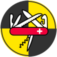

# mikenakis:testkit

#### My library of indispensable utilities for testing

 
The mikenakis:testkit logo, <i>a Swiss army knife over a test sign</i> 
by Mike Nakis, based on original work by <a href="https://thenounproject.com/term/multi-tool/1641155/">Mariah Gardziola</a>, license: <a href="https://creativecommons.org/licenses/by/3.0/us/">CC BY</a> 

## Description

`mikenakis:testkit` is a small library which contains various utility methods that I use in testing.

## Coding style

When I write code as part of a team of developers, I use the teams' coding style. However, when I write code for myself, I use _**my very own™**_ coding style.

More information: [michael.gr - On Coding Style](https://blog.michael.gr/2018/04/on-coding-style.html)
